# CUDA Flocking

**University of Pennsylvania, CIS 5650: GPU Programming and Architecture,
Project 1 - Flocking**

* Anna (Nanru) Dai
  *  [LinkedIn](https://linkedin.com/in/nanru-dai-8b33a9261)
* Tested on: Windows 11, AMD Ryzen 9 5950X @ 3.40GHz 128GB,
  NVIDIA GeForce RTX 3090 Ti 24GB, CUDA 13.3, personal machine

## Results

55,000 boids on the coherent uniform grid, running with visualization on. The
framerate in the title bar is the base metric INSTRUCTION.md asks for; everything
quoted later in this README comes from the harness instead, for reasons the
[benchmarking section](#benchmarking-setup) goes into.

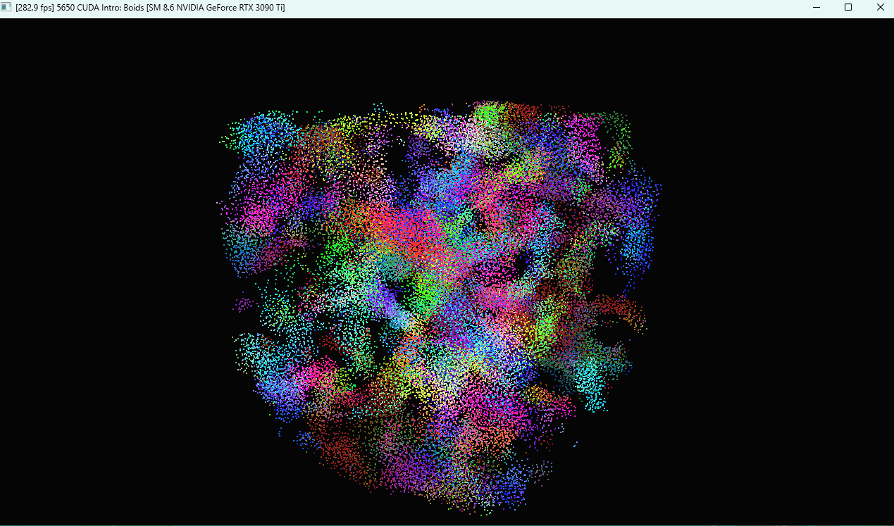

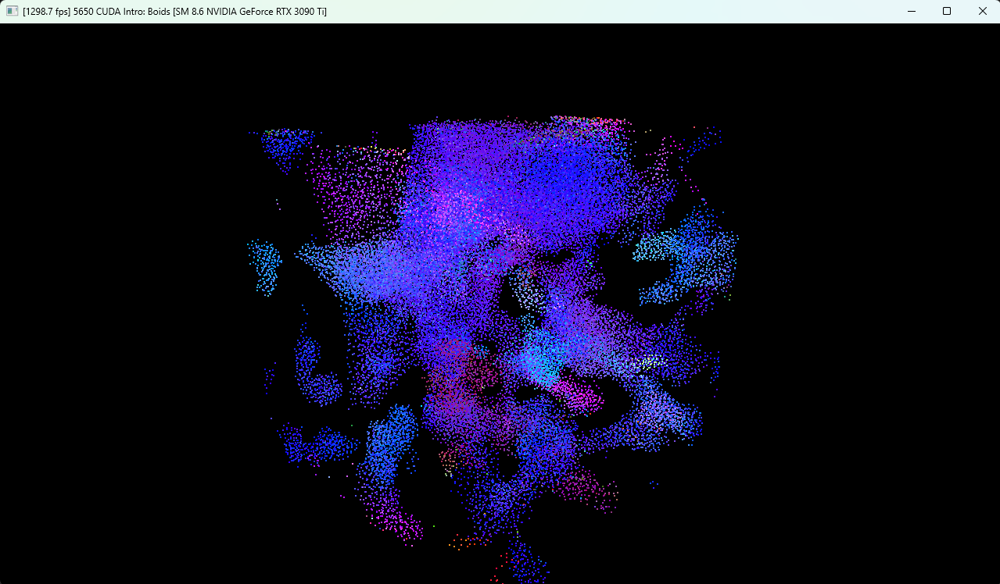

---

## Implementation

All three versions live in `src/kernel.cu`.

### Naive Implementation

The naive one is the direct reading of the boids rules (TODO-1.2).

- Each thread takes one boid, walks the entire population, accumulates cohesion,
  separation and alignment, clamps to `maxSpeed`, and writes into the second
  velocity buffer (`vel2`, so every thread keeps reading the unchanged `vel1`).
- `O(N^2)`, and mostly it exists as the baseline everything else gets measured
  against.

### Scattered Uniform Grid

> **Key idea:** the rules only reach a fixed distance, so most of the population
> can't influence a given boid at all. Bin the boids into a uniform grid and
> check only the cells close enough to matter, instead of all N. Full
> explanation in
> [INSTRUCTION.md §2.0](INSTRUCTION.md#20-a-quick-explanation-of-uniform-grids).

The TODO-2.1 comments lay out the pipeline. The six stages and their corresponded kernels are listed below:

| stage | kernel |
| --- | --- |
| label each boid with its cell | `kernComputeIndices` |
| sort boids by cell | `thrust::sort_by_key`, unstable |
| clear the cell table | `kernResetIntBuffer` |
| find where each cell starts and ends | `kernIdentifyCellStartEnd` |
| neighbor search | `kernUpdateVelNeighborSearchScattered` |
| integrate position | `kernUpdatePos` |

The thing to notice is what the sort does *not* move. **`thrust::sort_by_key` reorders indices, NOT boid data**, 
so whenever the neighbor search wants a position it goes through `dev_particleArrayIndices` first. 

> That extra hop is the entire reason the coherent version exists, and it's what turns up much later in the profile as 4.2 useful bytes out of every 32 fetched from memory.

Also notably, in my implementation,
-  Cell ends are stored as an exclusive bound, so the inner loop is just `for (i = start; i < end; i++)`. 
-  `kernResetIntBuffer` fills the start table with `-1` instead of zero, which makes an empty cell one compare to skip rather than a range check.

### Coherent Grid

> **Key idea:** after the sort, the *pointers* to a cell's boids are contiguous,
> but the positions and velocities they point at are still scattered all over
> memory. 
> Reorder that data to match the cell ordering and the neighbor search
> can index it directly, dropping `dev_particleArrayIndices` entirely. Full
> explanation in
> [INSTRUCTION.md §2.3](INSTRUCTION.md#23-cutting-out-the-middleman).

The coherent version adds `kernReorderCoherent`, which physically shuffles positions and velocities into cell order so the neighbor search can index them directly.

The first intuitive move is to allocate two new arrays, one for reordered positions and one for velocities. However, I decided to only allocate one new array, which is for position, `dev_posCoherent`.

This is mainly because `dev_vel2` already exists as the naive path's ping-pong target and is unused at that point in the frame, 
so the reordered velocities go there and only `dev_posCoherent` is new. 
That saves `N x 12` bytes.

The chain ends up as:

| step | kernel | reads | writes |
| --- | --- | --- | --- |
| reorder | `kernReorderCoherent` | `pos`, `vel1` | `posCoherent`, `vel2` |
| neighbor search | `kernUpdateVelNeighborSearchCoherent` | `posCoherent`, `vel2` | `vel1` |
| integrate | `kernUpdatePos` | `posCoherent`, `vel1` | `posCoherent`, in place |
| end of step | - | | swap `dev_pos` and `dev_posCoherent` |

Reading it as one flow:

```
pos, vel1 --reorder--> posCoherent, vel2 --neighbor--> vel1
                            |                           |
                            +--------- updatePos -------+
                                        |
                                 posCoherent (updated)
                                        |
                                 swap into dev_pos
```

`kernUpdatePos` writes the new positions back into `posCoherent` rather than
into a third buffer, which is what makes the final swap enough: after it,
`dev_pos` holds this frame's updated positions in cell-sorted order, ready for
the next frame to re-sort.

Only position buffers ping-pong. Velocities don't need to, since `vel1` is already
current when the step ends and the next frame's reorder reads `vel1` again.

### Cell traversal order

LOOK-2.3 asks which order to walk the neighboring cells in, and points at how we
flatten 3D to 1D:

```cpp
gridIndex3Dto1D(x, y, z, res) = x + y * res + z * res * res
```

Stepping `x` by one moves one cell along in memory. Stepping `y` skips `res`
cells, and stepping `z` skips `res * res`. So `x` belongs in the innermost loop
and `z` in the outermost: consecutive iterations of the inner loop then read
adjacent entries of `gridCellStartIndices`, and the large strides happen as
rarely as possible. 

This is why both grid kernels are implemented as: loop z, then y, then x.

I had the two looping in different orders at first, which would have made the
scattered against coherent comparison later change two things at once instead of
just the data layout.

### Grid-looping (extra credit 2)

Instead of hardcoding 8 or 27 grid cell searches, I derive the range from the
search radius:

```cpp
glm::vec3 minPos = (selfPos - glm::vec3(maxDistance) - gridMin) * inverseCellWidth;
glm::vec3 maxPos = (selfPos + glm::vec3(maxDistance) - gridMin) * inverseCellWidth;
// then loop z, y, x from floor(minPos) to floor(maxPos)
```

Because the bounds come from the radius, the same kernel works at any cell
width, which is what let me turn the cell width choice into a runtime flag:

`--cellwidth=2` gives 8 cells of width 2R and `--cellwidth=1` gives 27 cells of
width R. 

That flag makes automating the cell width experiment later on possible.


## Benchmarking Setup

### Environment

As per INSTRUCTION.md's requirements:

- Release build
- CUDA 13.3
- nothing else running on the GPU
- same machine for every data point
- V-sync off in the Nvidia Control Panel, plus `glfwSwapInterval(0)` in
  `init()` 
  - Only affects the visualized runs, since
  without them there's no `glfwSwapBuffers` to throttle.

### The three measurements

Three different measurements appear in this README, and they are not
interchangeable:

| measurement | what it covers | flag |
| --- | --- | --- |
| **Application FPS** | wall clock for the whole frame, including rendering and driver overhead. What the window title shows | `--bench=fps` |
| **Total GPU step time** | one CUDA event pair around the whole simulation step | `--bench=total` |
| **Per-stage GPU time** | a CUDA event pair and an NVTX range around each kernel and each Thrust call | `--bench=stages` |

The assignment asks for framerate plots, so the graphs use the first. The other
two are for working out *why* a curve looks the way it does. Mixing them up is
easy and expensive: at N = 5000 the renderer costs about 0.5 ms a frame while a
grid step is about 0.2 ms, so comparing the two grid versions by application FPS
at that size would mostly be comparing renderers.

The window title meter still works the way INSTRUCTION.md describes, in both
modes. It updates once a second instead of once a frame now, since `fps` is only
recomputed once a second anyway; the string shown is identical, it just isn't a
Win32 call on every iteration.

### Measurement protocol

Every configuration is measured over 3 separate runs of the program, with
warm-up frames thrown away at the start of each. 
The measurement window shrinks as N grows, because the slowest configurations at the top end take over 100 ms per frame (naive at N = 200000, scattered at N = 10^6) and 5000 of those would take longer than the rest of the sweep put together:

| N | warm-up | measured frames |
| --- | --- | --- |
| up to 20000 | 300 | 5000 |
| 50000 and 100000 | 300 | 1000 |
| 200000 and above | 100 | 300 |

Fewer frames means a wider spread, which is part of why I report the spread rather than only a mean. 
Every CSV row carries its own `samples` count, so the window is visible in the raw data too.

Each row reports **mean, median, p95, sample standard deviation, min and max**,
because several stages turn out to have a long right tail that a mean hides completely.

FPS is `1000 / mean_frame_time_ms`. That is the same quantity the title bar meter reports, since that counts frames over a second and divides, and
`mean = total_time / frames` makes the two identical. The harness also prints `1000 / median` as a sanity check: when the two disagree by much, the frame times have a tail and the mean on its own would be misleading. 
It is not the FPS definition and I never quote it alone.

### Command line flags

Configuration moved from `#define`s to command line flags, so a sweep is a shell loop rather than a rebuild per data point:

```bash
./cis5650_boids.exe --mode=scattered --n=5000 --block=128 --bench=stages
```

| flag | values | default | what it changes |
| --- | --- | --- | --- |
| `--mode` | `naive` / `scattered` / `coherent` | from the `UNIFORM_GRID` and `COHERENT_GRID` defines | which neighbor search runs |
| `--n` | boid count | 5000 | |
| `--block` | threads per block | 128 | only my kernels; Thrust picks its own launch configuration |
| `--cellwidth` | `2` or `1` | 2 | multiple of the neighborhood radius: 2 gives 8 cells of width 2R, 1 gives 27 cells of width R |
| `--visualize` | `0` / `1` | from the `VISUALIZE` define | 1 renders and maps the GL buffers each frame, 0 skips both |
| `--bench` | `none` / `fps` / `total` / `stages` | `none` | see below |
| `--warmup` | frames | 300 | frames discarded before measuring |
| `--frames` | frames | 5000 | frames measured, after which the program exits |

The `--bench` modes decide what gets recorded and how the program terminates:

| mode | records | exits on its own |
| --- | --- | --- |
| `none` | nothing | no, runs until the window is closed |
| `fps` | wall-clock frame times, with a `cudaDeviceSynchronize` fence each frame | yes |
| `total` | one CUDA event pair around the whole simulation step | yes |
| `stages` | a CUDA event pair **and an NVTX range** around every kernel and Thrust call | yes |

`stages` is the one that emits the NVTX ranges Nsight Systems needs to group
kernels by pipeline stage, so any trace meant for Nsight has to be captured with
it.

The base repo's `#define`s are still there as the defaults, so running with no arguments behaves exactly as before. 
Results append to `benchmark_results.csv` with the configuration written into every row.

Two of those flags reach into `kernel.cu`, through `Boids::setBlockSize` and `Boids::setCellWidthScale`. 
- `blockSize` used to be a `#define` and is now a variable, which costs nothing since it only ever feeds a launch configuration and never appears inside a kernel.
- `--cellwidth` takes the place of the two grid-width lines the starter code in `kernel.cu`
  - a scale of 2 gives cells of width 2R and a scale of 1 gives width R, and the neighbor search handles either without changes because of the grid-looping bounds.

### The harness

All of this lives in `src/benchmark.hpp` and `src/benchmark.cpp`, which is the custom profiling code API I added to the project. 
The only build change is those two files being added to the source and header lists in `CMakeLists.txt` (no flags, targets or settings were touched).

Instrumenting a stage is one line:

```cpp
{
    PROFILE_STAGE(sSort);
    thrust::sort_by_key(...);
}
```

`PROFILE_STAGE` opens an RAII scope that starts a CUDA event timer and pushes an NVTX range, and closes both when the scope ends. 
Pairing them means the two tools always see the same boundaries, and making it a scope rather than begin/end calls means I can't leave one unclosed on an early return. 
When the current mode doesn't want stage timing, the scope holds a null pointer and records nothing, which is what keeps `--bench=fps` runs clean.

Declaring `static bench::Stage sSort("scattered/sort")` is enough to make a stage appear in the report and the CSV, because the constructor registers it.

Three more decisions exist only so the numbers measure what they claim to.

**`--bench=fps` records nothing.** No CUDA events, no NVTX ranges. Otherwise
every FPS figure would include the cost of my own measurement. Anything captured
with Nsight attached is treated as diagnosis and never quoted as a result.

**`--bench=fps` fences once per frame** with `cudaDeviceSynchronize`. Without it
the CPU just fills the driver's launch queue and races ahead, so what gets
measured is enqueue cost rather than throughput. Naive at N = 100000 came out at
0.02 ms/frame that way, against a real GPU step time of 30 ms, and an `O(N^2)`
kernel appeared to cost the same at N = 5000 and at N = 100000. The grid modes
never showed the problem, because `thrust::sort_by_key` synchronizes internally
and throttles the CPU back to the GPU's pace, so it went unnoticed until naive
was measured.

**One synchronize per frame.** Reading a CUDA event timer means waiting on its
stop event, and doing that per stage would stall the CPU six times a frame and
change what is being measured. Instead every stage's stop event goes into the
stream ahead of the total timer's, so waiting on that one event makes all of
them readable. Two costs come with that:

- A `--bench=stages` run puts 12 extra events in the stream, which inflates its
  own `total` row. Any total GPU time quoted in this README therefore comes from
  `--bench=total`, which records two events per frame.
- Each stage owns one event pair and reuses it every frame, so a `--bench=total`
  or `--bench=stages` run cannot let the CPU work more than a frame ahead of the
  GPU. That is acceptable for two modes whose job is to measure GPU time, but it
  is why application FPS has to come from `--bench=fps` instead.

### GL interop in visualization-off runs

I originally assumed that with `VISUALIZE 0` the program was already measuring just the simulation, since that's what INSTRUCTION.md says the mode is for. 
However, in the base repo, `runCUDA()` calls `cudaGLMapBufferObject` twice at the top and `cudaGLUnmapBufferObject` twice at the bottom, 
and those four calls sit *outside* the `#if VISUALIZE` guard, and only the `copyBoidsToVBO` in the middle is guarded. 
So they run every frame even when nothing is being drawn.

I didn't know whether that mattered, so I built two binaries differing only in that one thing and ran them alternating A/B/A/B (alternating so that the GPU warming up and clocking down over the session hits both equally). 
I ran with cattered grid, N = 5000, block size 128, visualization off, 300 warm-up + 2000 measured frames:

| | mean frame time | mean FPS | individual runs (ms) |
| --- | --- | --- | --- |
| skip interop when not visualizing | **0.2719 ms** | **3678** | 0.2892 / 0.2886 / 0.2642 / 0.2456 |
| base repo, map/unmap every frame | **0.4622 ms** | **2164** | 0.4630 / 0.4552 / 0.4573 / 0.4731 |

That's 0.19 ms a frame, or 41% of the base repo's frame time, and the two sets of runs don't overlap. 
So at this problem size a good chunk of the base repo's "visualization off" framerate is a measurement of GL interop rather than of the
boids simulation.

I kept the change for that reason, but it does mean my visualization-off
numbers are higher than an unmodified base repo would give. 
The gap should shrink as N grows and the simulation starts to dominate that fixed per-frame cost, which is something I can check in the N scaling section.

## Nsight profiling

I profiled the scattered grid before running any of the experiments, to find out
where the time actually goes. Everything in this section is at N = 5000,
blockSize = 128, visualization off, and the numbers shown are from a re-capture
with the current code rather than the first pass.

### Nsight Systems

I put NVTX ranges around each stage, then captured a trace from the GUI:

| setting | value |
| --- | --- |
| Application | `build\bin\Release\cis5650_boids.exe` |
| Working directory | `build` |
| Arguments | `--mode=scattered --n=5000 --bench=stages --warmup=50 --frames=200` |
| Collect | CUDA trace, NVTX trace |

The working directory has to be `build` rather than the folder the executable sits in, since the shaders are loaded on a relative path. Getting that wrong produces a trace containing only the initialization kernel, which is how I found out. 
`--bench=stages` is what emits the NVTX ranges, and `--frames=200` makes the program exit on its own instead of needing to be stopped.

The per-kernel and per-range numbers below come out of the report's summary views, `CUDA GPU Kernel Summary` and `NVTX GPU Projection Summary`.

The first thing the trace shows is that `thrust::sort_by_key` isn't one kernel.
It expands into 6 CUB kernels plus 6 memsets per frame, and those 12 launches
are most of the GPU work at this size. Per frame:

| | GPU time per frame |
| --- | --- |
| *inside the sort stage* | |
| CUB radix sort, 6 kernels | 38.1 µs |
| memsets, 6 per frame | 4.2 µs |
| **sort subtotal, 12 operations** | **42.3 µs** |
| *everything else* | |
| `kernUpdateVelNeighborSearchScattered` | 21.3 µs |
| my other four kernels combined | 5.0 µs |

The second thing is more useful. 
My CUDA event timers put the sort stage at 152 µs, averaged over 3 runs of 5000 frames, against the 42.3 µs of actual GPU work in the subtotal above. 
Projecting the NVTX ranges onto the GPU timeline shows where the rest goes: 
the sort range spans 145 µs of GPU timeline and contains those same 12 operations, 
so about 103 µs, or 71% of the range, is the GPU sitting idle between Thrust's launches waiting for the host.

I had guessed the CUDA events were catching the cost of Thrust's temporary
allocations. The memsets are there, but they only account for 4.2 µs. The other
103 µs isn't work at all, it's idle GPU. So at N = 5000 the sort is expensive
not because sorting 5000 keys is hard, but because it costs 12 launches and the
GPU spends most of that window waiting.

The 145 µs projection is within 5% of the 152 µs my untraced CUDA events measure, 
so these gaps are real rather than an artifact of tracing.

You can see the gaps directly in the timeline:

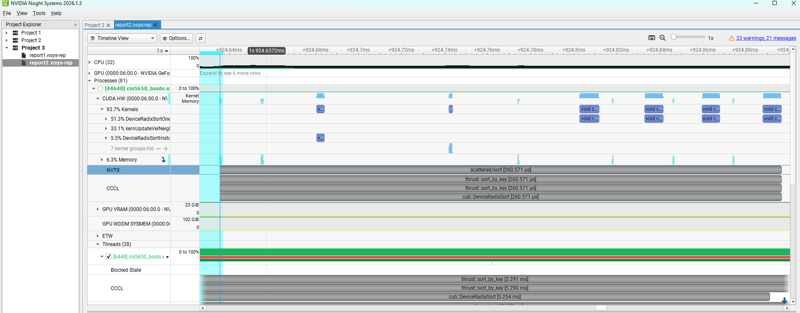

The grey bar is one `scattered/sort` NVTX range, with Thrust's own
`thrust::sort_by_key` and `cub::DeviceRadixSort` markers nested inside it. 
The small blue blocks on the `Kernels` rows below are the actual radix sort kernels,
and everything between them is idle GPU. 
The left panel shows the whole-capture kernel breakdown: 51.3% `DeviceRadixSortOnesweep`, 33.1% `kernUpdateVelNeighborSearchScattered`, 5.5% `DeviceRadixSortHistogram`. 
This particular range instance is 260 µs, which is slower than the 145 µs average over the capture.


### Nsight Compute
#### launch configuration

Both Nsight Compute captures in this README use the same activity settings. 
The GUI shows the equivalent command in its own Command Line box:

```
ncu --replay-mode application --app-replay-match grid --app-replay-buffer file
    --app-replay-mode relaxed --kill 1 --set full
    --kernel-name kernUpdateVelNeighborSearchScattered
    --launch-skip 20 --launch-count 1
    cis5650_boids.exe --mode=scattered --n=5000 --bench=fps --warmup=5 --frames=40
```

The application executable is the same Release binary the benchmarks use, 
and the working directory is `build` rather than the folder the executable sits in, 
because the shaders are loaded on a relative path.

`--set full` needs more counters than the hardware can collect in one pass, 
so the work has to be repeated.
`--replay-mode application` does that by running the whole program again for each pass and matching the launches across runs, which `--app-replay-match grid` does by grid dimensions. 
`--kill 1` stops the process once the profiled launch is done, so it doesn't have to play out all 40 frames each time. 
Block size and cell width are the defaults, 128 and 2R.

Worth noting is that this is **one launch of one kernel**. 
It says nothing about the coherent version, the sort, nor the rest of the frame. The Nsight Systems trace above is the part that covers
the whole step.

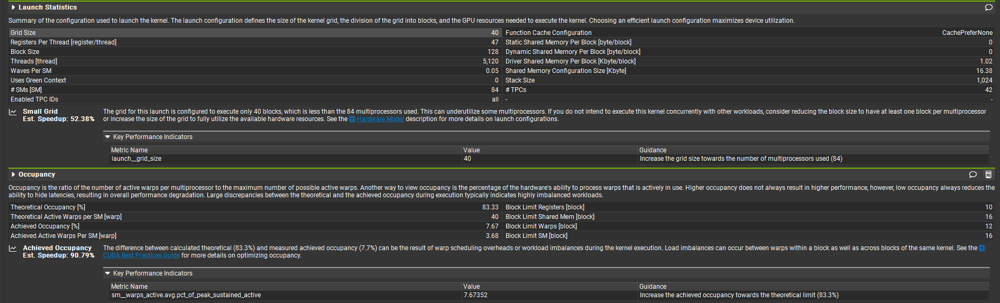

| | |
| --- | --- |
| Grid size | 40 blocks of 128 threads = 4 warps each |
| SMs on the device | 84 |
| Waves per SM | 0.05 |
| Registers per thread | 47 |
| Theoretical occupancy | 83.33% |
| Achieved occupancy | **7.67%** |
| Block limit, SM | 16 blocks |

`ceil(5000/128) = 40` blocks on 84 SMs, so fewer than half the SMs get any work, and Nsight says so directly with a Small Grid warning. 
The achieved occupancy isn't just low, it's at the ceiling this launch allows:
one block of 4 warps per SM against 48 warp slots is `4/48 = 8.33%`, and 7.67% sits just underneath.

#### warp stalls

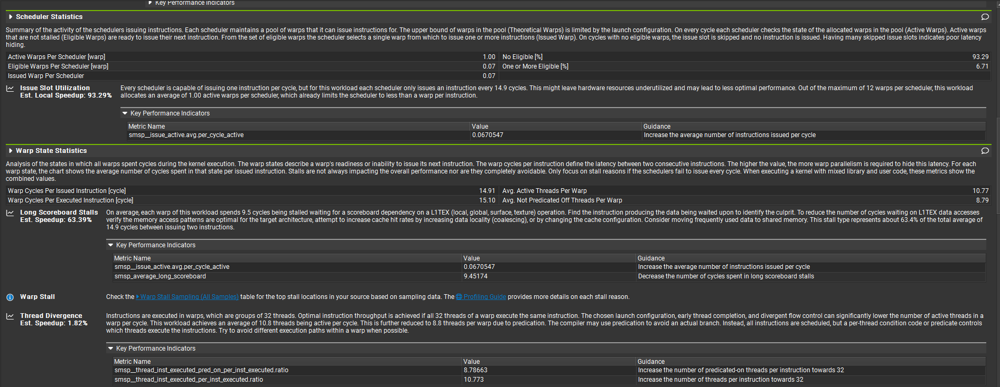

| | |
| --- | --- |
| Active warps per scheduler | 1.00 |
| Eligible warps per scheduler | 0.07 |
| Cycles with no eligible warp | **93.29%** |
| Warp cycles per issued instruction | 14.91 |
| Dominant stall | long scoreboard (L1TEX), 9.5 cycles, 63.4% of the total |
| Average active threads per warp | 10.77 of 32 |

Nothing is ready to issue on 93% of cycles, so each scheduler manages an
instruction about once every 15 cycles, and most of that wait is warps blocked
on L1TEX memory operations.

> Neither term came up in the course, so for reference: **L1TEX** is the per-SM
> unit holding the L1 data cache, shared memory and the texture path, so a global
> read goes L1TEX, then L2, then DRAM. A **long scoreboard** stall is a warp
> waiting on a data dependency from one of those loads, as opposed to a *short*
> scoreboard stall on faster on-chip traffic. Both are NVIDIA's terms, defined in
> the Nsight Compute Kernel Profiling Guide under
> [Units](https://docs.nvidia.com/nsight-compute/ProfilingGuide/index.html#units)
> and [Statistical Sampler](https://docs.nvidia.com/nsight-compute/ProfilingGuide/index.html#statistical-sampler).

So the kernel looks **memory-latency limited with not enough parallelism for
latency hiding**. Two explanations I considered and ruled out first:

* *Registers.* 47 per thread, but theoretical occupancy is still 83.33%, so the register budget was never the binding constraint.
* *Bandwidth.* The Speed of Light and Memory Workload sections of the same
  capture rule it out:

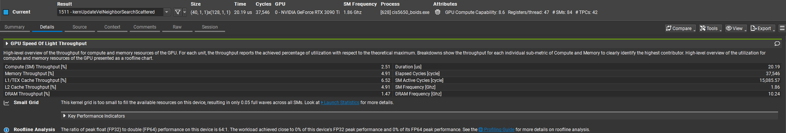

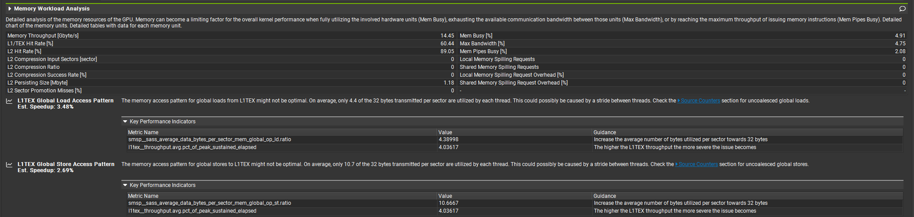

> Note on the screenshots: every `Est. Speedup` Nsight prints is a heuristic from its rule engine, not a measurement, so none are quoted as results here.

  * "Stalled on memory" isn't the same as "out of bandwidth". Bandwidth bound would mean DRAM running near peak, and the fix would be moving less data.  Here DRAM throughput is 1.47% of peak, the L2 hit rate is 89.05%, and occupancy is 7.67%, so the warps wait not because memory is slow but because nothing else is ready to run when one of them stalls. That points at more parallelism, which is what the N scaling experiment tests.


I also captured this after switching the scattered kernel to z-major cell traversal, and every number above is within a percent or two of what I measured before that change. 
Reordering the traversal did not help at N = 5000, which is consistent with the diagnosis. 
If the kernel is waiting on parallelism rather than on locality, then improving locality has nothing to work with. 
Its value is that it makes the scattered and coherent kernels differ in
one variable, which is why I changed it.

I predict that block size shouldn't matter much at N = 5000, and that
raising N should help until the GPU fills up. 
Both are tested in the
[boid count](#boid-count) and [block size](#block-size) sections below, where  the second one holds cleanly while the first turns out to be only half right.


## Performance experiments

The sweep scripts and the plotting script are in `tools/`, and the raw CSVs are in `results/`, so every figure below can be regenerated with
`tools/sweep*.sh` followed by `py tools/plot.py`. 

Every point is the mean of 3 separate runs of the program. 
The error bars span the min and max of those 3 run means, except on the cell width plot, where they are ratios and are explained in
that section.

Unless a section says otherwise, everything here runs at block size 128, cell
width 2R, and visualization off, which are the defaults.

### Boid count

The Nsight section left me thinking that at N = 5000 the kernel is limited by
not having enough parallel work rather than by the memory system. If that's
right, adding boids should be close to free until the GPU runs out of idle
capacity, and only after that should the cost start following each
implementation's actual complexity.

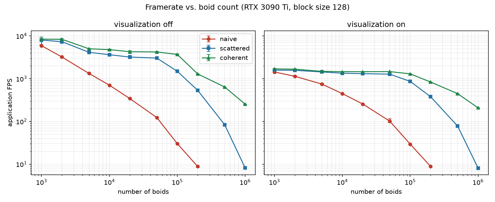

> Source: `results/n_scaling.csv`, `stage=frame_wall`, both `visualize` values.

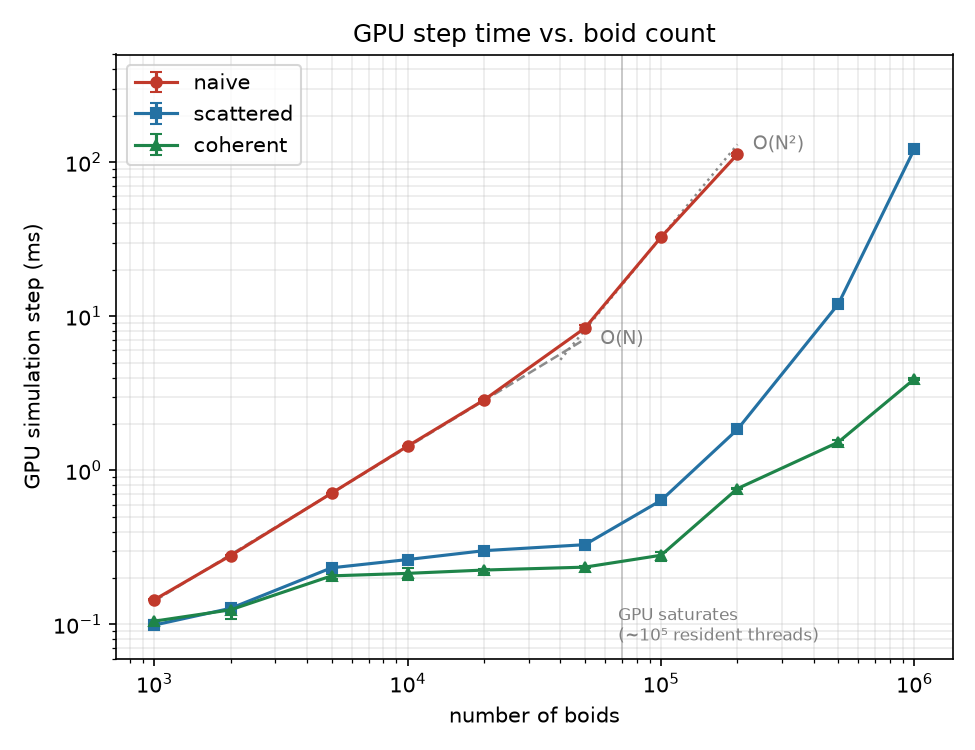

> Source: `results/n_scaling.csv`, `visualize=0`, `stage=total`.

The result aligns with my hypothesis, and the second plot shows it most clearly. 
The naive curve tracks `O(N)` up to roughly N = 5×10^4 and then bends over to `O(N^2)`:

| N step | N × | work × (N^2) | measured time × |
| --- | --- | --- | --- |
| 1000 → 2000 | 2 | 4 | **1.93** |
| 5000 → 10000 | 2 | 4 | **2.03** |
| 10000 → 20000 | 2 | 4 | **1.99** |
| 20000 → 50000 | 2.5 | 6.25 | **2.93** |
| 50000 → 100000 | 2 | 4 | **3.89** |
| 100000 → 200000 | 2 | 4 | **3.45** |

> First two columns are arithmetic on the N ratio, not measurements. Last
> column: `results/n_scaling.csv`, `mode=naive`, `visualize=0`, `stage=total`,
> mean of 3 runs.

Naive gives every thread the whole population to walk, so per-thread work grows with N, total work grows with N^2, and the thread count is N. 
Below saturation the extra threads land on SMs that had nothing to do, so the wall time only follows the per-thread work and grows with N. 
Above saturation there is nowhere left to put them, so the wall time follows the total work and grows with N^2.

So the bend tells me where this GPU fills up. It happens between 5x10^4 and 10^5 threads, and the card holds 84 SMs x 48 warps x 32 threads = 129,024 resident threads, which corresponds.

The grid implementations show the same plateau in a milder form. Going from
N = 1000 to N = 50000, a 50x increase, costs scattered only 3.3x and coherent
only 2.2x.

The two smallest points are close to the resolution of my setup and I'm not
resting anything on them: at N = 1000 and 2000 the visualization-off frame times are only 0.10 to 0.17 ms and the run-to-run spread reaches 41%.

### Visualization on and off

Subtracting the two panels of the first plot gives the cost of rendering:

| | N = 1000 | N = 5000 | N = 100000 | N = 1000000 |
| --- | --- | --- | --- | --- |
| naive | +0.53 ms | +0.58 ms | +0.86 ms | - |
| scattered | +0.51 ms | +0.46 ms | +0.48 ms | +1.03 ms |
| coherent | +0.47 ms | +0.47 ms | +0.50 ms | +0.87 ms |

> Source: `results/n_scaling.csv`, `stage=frame_wall`, the `visualize=1` mean
> minus the `visualize=0` mean at each N.

Rendering costs a roughly **fixed** 0.5 ms per frame until the vertex count
gets large enough to matter on its own, somewhere past N = 10⁵.

That fixed cost is why the right-hand panel says so much less than the left one.
The two grid versions sit between 1300 and 1700 FPS everywhere below N = 20000
and can't be told apart, because what's being measured there is the renderer
rather than the simulation. Naive only sits in that band at N = 1000; by
N = 2000 it is already about 30% below them, and by N = 5000 it is at 748 FPS
against their 1437 and 1486. That crossover matches its GPU step time, which is
0.280 ms at N = 2000 and 0.710 ms at N = 5000, so it passes the renderer's
roughly 0.5 ms somewhere in between. Same effect as the GL interop measurement
earlier, and presumably why INSTRUCTION.md says to turn visualization off.

### Coherent versus scattered

Both grids do the same neighbor search over the same cells, so the only
difference is whether the position and velocity data is reordered to match the
cell ordering. GPU step time, visualization off:

| N | boids per cell | scattered | coherent | speedup |
| --- | --- | --- | --- | --- |
| 5000 | 0.6 | 0.233 ms | 0.207 ms | 1.13× |
| 50000 | 6 | 0.329 ms | 0.235 ms | 1.40× |
| 100000 | 13 | 0.638 ms | 0.281 ms | 2.27× |
| 200000 | 25 | 1.842 ms | 0.761 ms | 2.42× |
| 500000 | 63 | 11.98 ms | 1.522 ms | 7.87× |
| 1000000 | 125 | 122.2 ms | 3.922 ms | **31.2×** |

> Timings: `results/n_scaling.csv`, `visualize=0`, `stage=total`.
>
> Boids per cell is not measured. It is `N / 8000`, an average over the roughly
> 8000 cells the boids can occupy: they start inside a 200-unit cube and
> `kernUpdatePos` wraps them back into it, so at cell width 10 that is `20³`
> cells. The average also assumes they spread evenly, which flocking works
> against, so the busiest cells hold more than this and the column is only good
> for showing how density grows with N.

The direction was what I expected. The size of it was not, and neither was how
strongly it depends on N. At the N = 5000 that the project defaults to,
reordering buys 13%, small enough that I would not have trusted it without
repeated runs. The interesting part only appears once the cells are crowded.

The reason the two columns diverge is that the grid does not grow with N. Cell
width is fixed at `2 × 5.0`, which gives `22³ = 10,648` cells covering a fixed
volume, so the boids per cell in the table above is just N divided by the
roughly 8000 cells the boids actually occupy. Neighbor count per boid therefore
grows linearly with N, and every one of those neighbors is a global memory read.
Coherent reads them from consecutive addresses. Scattered reaches them through
`dev_particleArrayIndices`, so at N = 10⁶ each thread is doing on the order of
a thousand scattered gathers.

Scattered also degrades **worse than quadratically** at the top end, which
neither implementation's algorithm predicts:

| N step | N × | scattered time × | coherent time × |
| --- | --- | --- | --- |
| 200000 → 500000 | 2.5 | 6.5 | 2.0 |
| 500000 → 1000000 | 2 | **10.2** | 2.6 |

> Same source as the table above, expressed as step-to-step ratios.

A 10.2× cost for a 2× increase in N is past what the growth in neighbor count
alone explains, so I profiled the scattered kernel again at N = 10⁶ to see what
had changed since the N = 5000 capture. Identical Nsight Compute settings to
that one, block size 128 and cell width 2R as everywhere else, only the boid
count and the skip differ:

```
... --launch-skip 3 --launch-count 1
    cis5650_boids.exe --mode=scattered --n=1000000 --bench=fps --warmup=3 --frames=12
```

Fewer skipped launches than at N = 5000, because at this size a single frame
already takes over 100 ms and application replay has to run the program once per
pass.

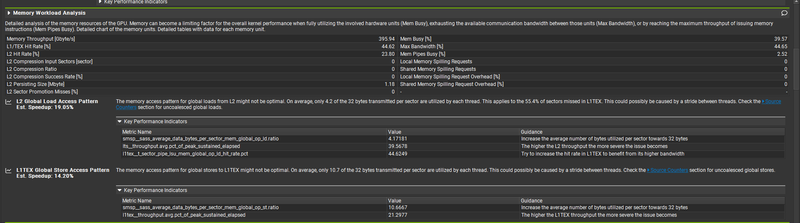

Side by side with the N = 5000 capture from the
[Nsight Compute section](#nsight-compute):

| | N = 5000 | N = 10⁶ |
| --- | --- | --- |
| Duration | 20.19 µs | 143.27 ms |
| Achieved occupancy | 7.67% | **80.70%** |
| Compute (SM) throughput | 2.51% | 2.52% |
| DRAM throughput | 1.47% | **44.65%** |
| Memory throughput | 14.45 GB/s | 395.94 GB/s |
| L1/TEX hit rate | 60.44% | 44.62% |
| L2 hit rate | **89.05%** | **23.80%** |

> Both columns read out of the saved Nsight Compute reports:
> `prof_stages.nsys-rep.ncu-rep` for N = 5000 and `prof_stages1.nsys-rep.ncu-rep`
> for N = 10⁶, Speed of Light and Memory Workload Analysis sections. The N = 5000
> column is the same capture screenshotted in the
> [Nsight Compute section](#nsight-compute).

The first thing to note is that the problem from the N = 5000 capture is gone.
Occupancy is 80.70% against a theoretical ceiling of 83.33%, so the GPU is as
full as this kernel can make it and there is no shortage of warps to switch to.
Compute throughput is still 2.52%, though, so it is still barely doing any
arithmetic.

What did change is the memory side. DRAM goes from 1.47% of peak to 44.65% and
the L2 hit rate collapses from 89.05% to 23.80%, so the working set has stopped
fitting in cache. Nsight also points at the mechanism directly:

> On average, only **4.2 of the 32 bytes** transmitted per sector are utilized
> by each thread. This applies to the **55.4% of sectors missed in L1TEX**.

So every 32 byte sector pulled from memory delivers about 4 useful bytes, around
13% efficiency, which is what the scattered layout's indirection would be
expected to produce. Each thread reads `pos[boidIndex]` where `boidIndex` comes
from `dev_particleArrayIndices` and is effectively random, so each read lands on
its own cache line and uses one `vec3` out of it. At 125 boids per cell that's
on the order of a thousand such reads per thread.

Nsight still classifies this as a latency issue rather than a bandwidth one,
because both compute and memory are below 60% of peak. The right description is
**stalled on the latency of uncoalesced accesses**, not "out of bandwidth", since
44.65% of peak is a long way from saturated.

So the bottleneck moved rather than just growing:

| | N = 5000 | N = 10⁶ |
| --- | --- | --- |
| Both are | latency limited | latency limited |
| but because of | **not enough parallelism** (7.67% occupancy, DRAM at 1.47%) | **uncoalesced access** (80.70% occupancy, 4.2 of 32 bytes used per sector) |

The code didn't change between those two rows, only N did, and the reason it's
slow is not the same one. Fixing the first problem by adding work did not make
the kernel fast, it made the second problem visible. It also explains why
coherent pulls so far ahead at this size: it reads its neighbors from
consecutive addresses, so its sectors come back full.

### Block size

Produced by `tools/sweep_block.sh`. Two boid counts on purpose: 5000 sits below
the point where the GPU fills up and 100000 sits above it.

I went in expecting block size to barely matter at N = 5000. The reasoning was
that the total warp count is `ceil(5000/32) = 157` no matter how the threads
are grouped, so if the problem is not having enough parallel work, regrouping
the same work shouldn't help.

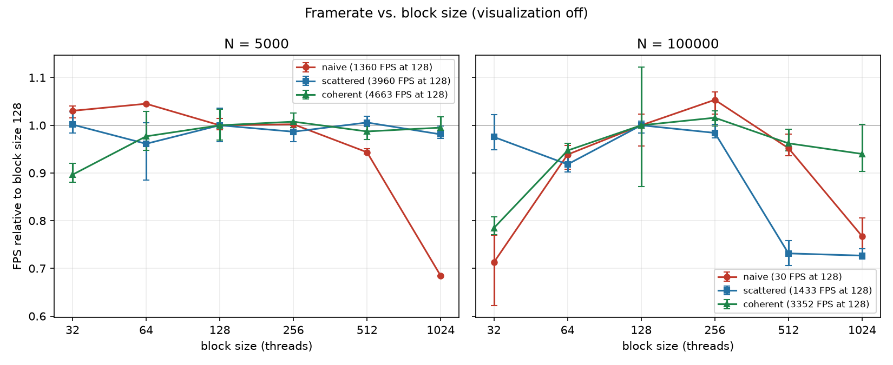

> Source: `results/block_size.csv`, `stage=frame_wall`, plotted relative to each
> mode's own block size 128 result.

Turns out my expectation is half right, and the halves have to be separated
carefully, because at N = 5000 a frame is only about 0.25 ms and the runs
themselves scatter.

Scattered shows no measurable dependence on block size: its largest deviation is
4%, at block size 64, where the three runs spread 13% on their own. That is
noise rather than an effect, and it is what I predicted. Coherent is the
exception at block size 32, which is 12% slower and whose runs do not overlap the
block size 128 runs at all (0.2331 to 0.2434 ms against 0.2075 to 0.2214 ms), so
that one is real and the prediction does not hold there. Naive at block size 1024
takes 1.46× as long, a 32% drop in framerate, and it is the cleanest result of
the three, with 0.6% spread across its runs.

What I missed is that a block is the unit that gets assigned to an SM, so block
size doesn't change how much parallel work exists but it does decide how finely
that work can be spread out:

| block size | blocks at N = 5000 | SMs that can get work (of 84) |
| --- | --- | --- |
| 32 | 157 | 84 |
| 64 | 79 | 79 |
| 128 | 40 | 40 |
| 256 | 20 | 20 |
| 512 | 10 | 10 |
| 1024 | 5 | **5** |

> Arithmetic, not measured: `ceil(5000 / block size)`, capped by the 84 SMs on
> the device.

At 1024 threads per block there are only 5 blocks, so the whole launch lands on
5 SMs and the other 79 sit idle. Those 5 blocks are 160 warps, of which 157 have
real work; the count barely changes, only where it can go. That doesn't
contradict the parallelism story from the previous section, it's the same effect
approached from the other side.

It is worth noting that 256 threads per block uses only 20 SMs and is still as
fast as 128, so covering more SMs is not automatically better. Fewer SMs each
holding more warps hides latency about as well, right up until there are so few
SMs left that nothing can compensate.

Above saturation the curve turns into a shallow U with the best results at 128
to 256, and time relative to block size 128 looks like this:

| block | naive | scattered | coherent |
| --- | --- | --- | --- |
| 32 | **+40%** | +3% | **+27%** |
| 64 | +7% | **+9%** | +6% |
| 128 | baseline | baseline | baseline |
| 256 | **−5%** | +2% | −2% |
| 512 | +5% | **+37%** | +4% |
| 1024 | **+30%** | **+38%** | +6% |

> Source: `results/block_size.csv`, `n=100000`, `stage=frame_wall`, each mode's
> mean divided by its own block size 128 mean.
>
> Bold marks the cells where the three runs do not overlap the three block size
> 128 runs. Only 7 of the 18 clear that bar; the rest are inside the run-to-run
> scatter and I read them as no measurable difference rather than as small
> effects.

The penalty at 32 has an explanation I can check against the Nsight Compute
capture above, which reports `Block Limit SM [block] = 16`. At 32 threads per
block each block is a single warp, so 16 resident blocks means 16 resident warps
out of 48, and occupancy is capped at 33% regardless of how many threads are
waiting to run.

The large block sizes are less consistent than the table's bold makes them look.
Scattered is the only one penalised at 512, and at 1024 it is joined by naive
while coherent stays inside its own scatter. I don't have a verified explanation
for any of them: register pressure, tail effects and coarser load balancing would
all produce this shape, and I haven't profiled these configurations to pinpoint
the exact factor.

There's also a limit to how much this experiment can say about the grid versions.
`--block` only controls the kernels in `kernel.cu`, and `thrust::sort_by_key`
picks its own launch configuration, so part of the step is always out of reach.
How much depends on N, since the sort is a nearly fixed cost while everything
else grows:

| N | sort share of the scattered step |
| --- | --- |
| 5000 | 51% |
| 100000 | 23% |
| 1000000 | 1% |

> Source: `results/cell_width.csv`, `mode=scattered`, `cell_width_scale=2`, the
> `scattered/sort` stage against the `total` row.

So the N = 5000 panel only moves about half the work, the N = 100000 panel moves
about three quarters of it, and naive is the cleanest test at either size since
all of its time is in a kernel I control.

### Cell width: 8 cells against 27

Produced by `tools/sweep_cellwidth.sh`. Cell width is a runtime flag
(`--cellwidth=2` or `--cellwidth=1`) rather than the commented-out line the
starter code ships with. The neighbor search derives its cell bounds from the
search radius instead of hard-coding a count, so both widths work without any
change to the kernel.

The assignment warns that "27-cell is slower because there are more cells to
check" is not a good answer, and the volume calculation shows why. With cells
of width 2R the search box spans at most 2 cells per axis, and with width R it
spans at most 3:

| cell width | cells searched | volume searched |
| --- | --- | --- |
| 2R | 8 | 8 × (2R)³ = **64R³** |
| R | 27 | 27 × R³ = **27R³** |

> Arithmetic from the search radius and cell width, not measured.

Checking 27 cells covers **less than half** the volume of checking 8, so it
should visit fewer boids, not more. Going in I still expected the 8-cell grid
to win at small N, because width R makes `42³ = 74,088` cells to clear every
frame instead of `22³ = 10,648`.

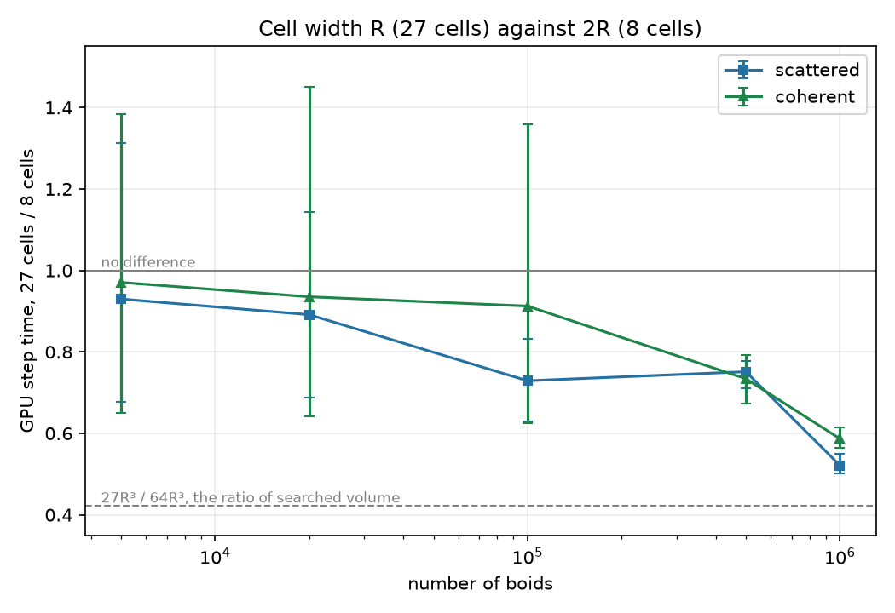

> Source: `results/cell_width.csv`, `stage=total`. Points are the ratio of the
> `cell_width_scale=1` mean to the `cell_width_scale=2` mean.

| N | scattered, 27/8 | coherent, 27/8 |
| --- | --- | --- |
| 5000 | 0.93× | 0.97× |
| 20000 | 0.89× | 0.94× |
| 100000 | **0.73×** | 0.91× |
| 500000 | **0.75×** | **0.73×** |
| 1000000 | **0.52×** | **0.59×** |

> Same source as the plot. Bold marks the rows where the three runs on each side do not overlap.

Width R is faster and the advantage grows with N, but the table on its own
overstates how much of that I can actually claim. The error bars on the plot
are not standard deviations. They are the narrowest and widest ratios the three
runs on each side allow, so they combine the extremes of the numerator and the
denominator, and wherever the interval covers 1.0 the two cell widths are not
distinguishable with three runs. Reading them that way:

| | distinguishable from |
| --- | --- |
| scattered | N = 100000 |
| coherent | N = 500000 |

> Derived from the same CSV: the smallest N at which the min-to-max range of the
> 3 runs at one cell width stops overlapping the other's.

Below those points I can only say there is **no measurable difference**, not
that width R wins slightly. At N = 5000, for instance, the three runs give
0.245 to 0.345 ms for 8 cells and 0.234 to 0.322 ms for 27, which overlap
almost entirely. The numbers in bold above are the ones whose runs do not
overlap.

My prediction about the clearing cost was simply wrong, and the stage
breakdown shows why:

| stage, scattered at N = 10⁶ | 2R (8 cells) | R (27 cells) |
| --- | --- | --- |
| reset_cells | 0.0241 ms | 0.0215 ms |
| neighbor_search | 123.62 ms | **63.90 ms** |
| everything else | ~1.4 ms | ~1.3 ms |

> Source: `results/cell_width.csv`, `mode=scattered`, `n=1000000`, the
> `scattered/*` stage rows from the `--bench=stages` runs.

Clearing 74,088 ints is a 296 KB write, which is under a microsecond of
bandwidth on this card. The 21 to 24 µs the stage actually reports is
essentially kernel launch overhead, and it does not care how many cells there
are. I had treated a cost that doesn't exist as one side of a tradeoff.

The whole difference is in the neighbor search, which is what the volume
argument predicts. The predicted ratio is 27/64 = 0.42 and the best measured
ratio is 0.52. The gap is presumably the per-cell bookkeeping, since the 27
cell version does 27 start/end lookups per boid instead of 8, plus the fact
that the boids clump rather than staying uniformly distributed. I have not
separated those two.


## References

What I used to learn the profiling side of this project:

* [NVIDIA/nsight-training](https://github.com/NVIDIA/nsight-training) — the
  official guided labs for Nsight Systems and Nsight Compute. Most of how I
  read the Nsight Compute sections above (occupancy, scheduler statistics, warp
  stall reasons) comes from here.
* [Princeton `gpu_programming_intro`, 04_gpu_tools](https://github.com/PrincetonUniversity/gpu_programming_intro/blob/master/04_gpu_tools/README.md)
  — a short practical intro to `nsys` and `ncu`, which is where I started.
* [CUDA C++ Programming Guide](https://docs.nvidia.com/cuda/cuda-c-programming-guide/)
  and the [Best Practices Guide](https://docs.nvidia.com/cuda/cuda-c-best-practices-guide/)
  for the occupancy and warp-slot numbers used above.
